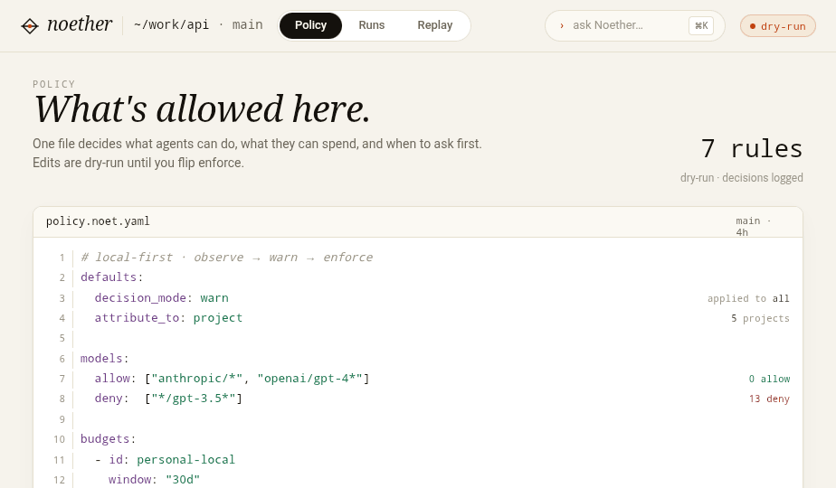
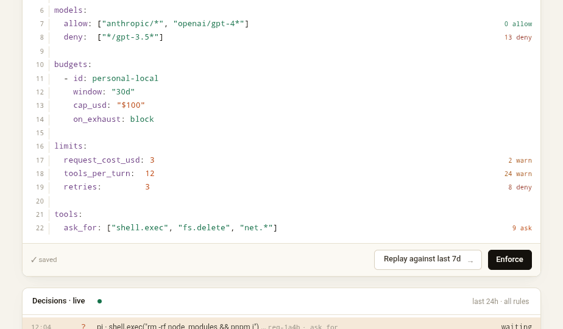
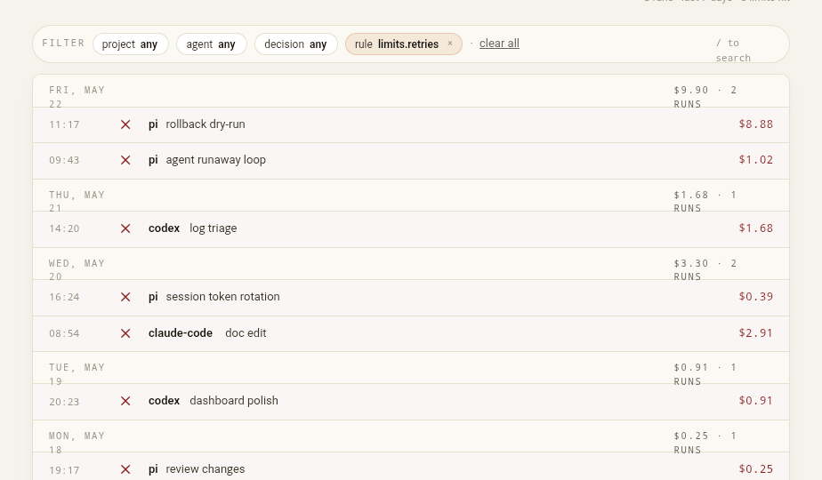
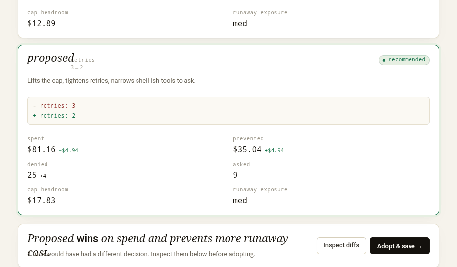
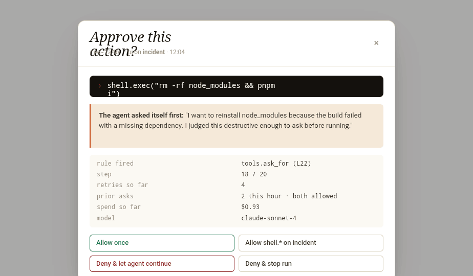
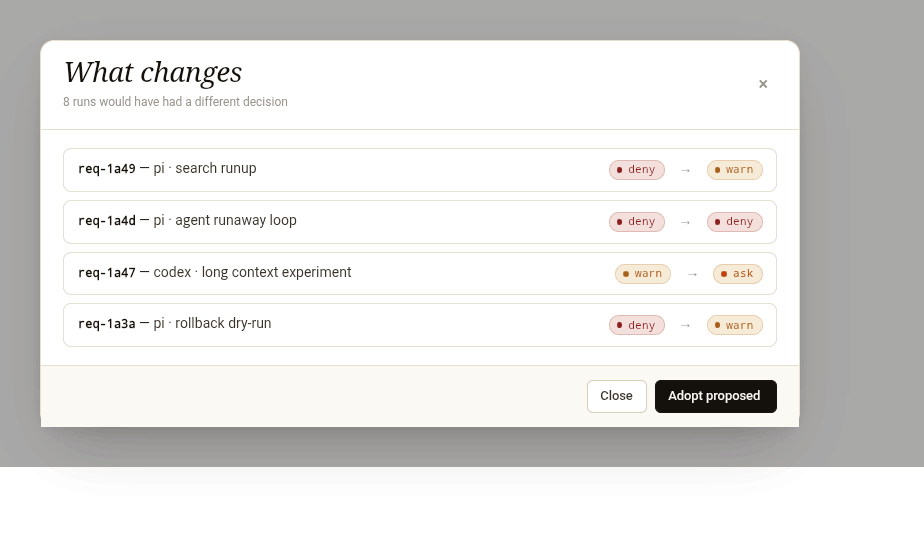

# Noether

<p align="center">
  
</p>

<p align="center">
  
</p>

**Noether is the policy file for agent work: written once, simulated honestly, enforced quietly,
and explained by every decision it makes.**

Noether is a local-first governance layer for AI work. Your harness, SDK, app, or gateway calls the
sidecar before and after model work; Noether handles policy, attribution, usage accounting, and
replay. Your integration still owns provider transport.

Noether does **not** call model providers as part of its production integration surface. The
integration owns provider transport. Noether decides, records, reconciles, and explains.

## Getting started

Prerequisite: Rust/Cargo.

### 1. Run the end-to-end local proof

```bash
./examples/vertical-mvp-demo.sh
```

That script starts a temporary sidecar, authorizes a request, reserves budget, finalizes observed
usage, records trace/tool/eval events, and prints usage, decision, trace, and observation reports.

It writes the demo ledger here:

```text
.noet/demo/vertical-mvp.sqlite
```

### 2. Open the app against that ledger

```bash
cargo run --bin noet -- serve \
  --policy examples/policy.noet.yaml \
  --decision-mode enforce \
  --db-path .noet/demo/vertical-mvp.sqlite
```

Open:

```text
http://127.0.0.1:4040/policy
http://127.0.0.1:4040/runs
http://127.0.0.1:4040/replay
http://127.0.0.1:4040/docs
```

Check that the sidecar is healthy:

```bash
curl -fsS http://127.0.0.1:4040/health
```

### 3. Replay a policy scenario

```bash
cargo run --bin noet -- scenario run examples/scenarios/runaway-agent-limit.noet.yaml
```

Open the generated artifact:

```text
.noet/scenarios/runaway-agent-limit/noether-dashboard.html
```

## How to use Noether

### Use the app

- `/policy`: edit and inspect the active `policy.noet.yaml`
- `/runs`: browse attributed decisions and usage evidence
- `/replay`: compare current and proposed policy against recorded history
- `/docs`: read the served API docs

### Use the sidecar API

The integration lifecycle is:

```text
authorize -> provider call -> finalize -> events
```

Ask Noether before provider spend:

```bash
curl -fsS http://127.0.0.1:4040/v1/authorize \
  -H 'content-type: application/json' \
  -d '{
    "subject": "user:demo",
    "project": "noether",
    "provider": "openai-codex",
    "model": "gpt-demo",
    "estimated_tokens": 1200,
    "estimated_cost_usd": 0.0024
  }'
```

Then your integration calls the provider. Afterward, finalize the reservation with the actual
outcome and usage:

```bash
curl -fsS http://127.0.0.1:4040/v1/reservations/<reservation-id>/finalize \
  -H 'content-type: application/json' \
  -d '{
    "outcome": "success",
    "actual_cost_usd": 0.0021,
    "usage": {
      "provider": "openai",
      "model": "gpt-demo",
      "input_tokens": 900,
      "output_tokens": 180,
      "total_tokens": 1080,
      "cost_usd": 0.0021
    }
  }'
```

`outcome` is explicit: `success`, `failure`, or `cancelled`. Noether rejects invalid accounting
such as negative costs or impossible token totals.

Machine-readable API docs are served by Noether:

```text
GET /openapi.json
GET /docs
```

### Use an SDK or integration

- TypeScript SDK: `sdk/typescript`
- Python SDK: `sdk/python`
- Rust SDK: `sdk/rust`
- Pi extension: `extensions/pi-noether`
- LiteLLM callback: `integrations/litellm`
- OpenCode, Claude Code, and Codex adapters: `integrations/`

### Use the CLI

```bash
cargo run --bin noet -- report decisions
cargo run --bin noet -- report usage
cargo run --bin noet -- report trace <trace_id>
cargo run --bin noet -- simulate examples/simulations/runaway-pressure.noet.yaml
```

## Product surfaces

The app is intentionally not a generic KPI dashboard. It has three first-class surfaces and one
loop:

```text
Policy -> Runs -> Replay -> Policy
```

### Policy: what's allowed here.

Policy is the home. The editor shows the live `policy.noet.yaml`, inline rule tallies, a live
decision tail, and a quiet suggestion when the current rules are producing a pattern.

<p align="center">
  
</p>

### Runs: what actually happened.

Runs is the evidence surface: every agent run is a decision row, not a raw log line. Filter by
project, agent, decision, or rule; open a run to see the policy reason and accounting trail.

<p align="center">
  
</p>

### Replay: what would change.

Replay compares current and proposed policy against the same recorded history. Try a stricter rule,
inspect changed decisions, then adopt only if the tradeoff is right.

<p align="center">
  
</p>

### Approval and diff details stay in context.

Pending asks, run details, command navigation, and policy diffs appear as focused overlays instead
of becoming separate dashboards.

<table>
  <tr>
    <td width="50%">
      
    </td>
    <td width="50%">
      
    </td>
  </tr>
</table>

## From one operator to one org

### For individuals

- keep using your existing AI tools
- add local guardrails and spend visibility
- see what your agent actually did
- keep prompts and workflow data local by default

### For teams

- add shared attribution and policy visibility
- introduce approval and governance progressively
- keep existing harnesses and gateways
- model policy changes before rollout

## Why this is different from another AI dashboard

Noether is useful because it puts policy at the center:

| Without Noether | With Noether |
| --- | --- |
| Spend appears later on a provider bill. | Every run can be attributed to a project, subject, model, trace, and budget. |
| Agents can retry, switch models, or burst tools without a local policy gate. | Integrations ask before spend and can block, warn, or request approval. |
| Dashboards show cost but not why it happened. | Reports connect policy decisions, reservations, usage, tool events, and replay. |
| Policy rollout is guesswork. | Scenarios and simulations show what would change before enforcement. |

## Common use cases

### 1. Block un-attributed AI work before it spends money

If a harness, gateway, or SDK call does not include a project, Noether can deny it before the
provider call happens:

```json
{
  "outcome": "deny",
  "action": "block",
  "explanations": [
    {
      "rule_id": "require-project",
      "reason": "project is required for budget attribution",
      "severity": "deny"
    }
  ]
}
```

### 2. Stop runaway agents without replacing your tools

Use rolling burst caps, daily caps, model allowlists, and request-cost limits beside the tools you
already use. Pi keeps its provider auth. LiteLLM keeps routing. Codex, Claude Code, and OpenCode keep
their own harness behavior. Noether supplies the decision boundary and evidence trail.

### 3. Explain the bill after the run

Finalize actual usage after the provider call and connect it to the decision that allowed it:

```text
decision.allow -> reservation.active -> usage.finalized
trace_id=run-123 project=noether subject=user:local model=gpt-demo cost=$0.0021
```

That gives reports answers a generic dashboard usually cannot:

- which policy allowed it
- which project/user should pay
- which model and harness were involved
- which tool events happened around the run

### 4. Test policy changes before enforcing them

Run scenarios and simulations locally before rollout:

```bash
cargo run --bin noet -- scenario run examples/scenarios/runaway-agent-limit.noet.yaml
cargo run --bin noet -- simulate examples/simulations/runaway-pressure.noet.yaml
```

Use this to answer: "Would this policy block the expensive bad run without killing healthy
adoption?"

## Policy examples to copy

### 1. Require project attribution

Block AI work that cannot be charged to a real project:

```yaml
version: 0
budgets:
  - id: noether-dev-daily
    limits:
      spend:
        - id: budget-cap
          window: 1d
          mode: tumbling
          anchor:
            kind: first_seen
          max_usd: 1.00
          warn_at_fraction: 0.8
          action: block
    match:
      project: noether
policies:
  - id: require-project
    action: block
    reason: project is required for budget attribution
    when:
      missing: project
```

File: `examples/policy.noet.yaml`

### 2. Cap expensive single requests

Stop a runaway agent request before spend lands:

```yaml
limits:
  request_cost:
    max_usd: 1.0
    action: block
```

Based on: `examples/scenarios/runaway-agent-limit.noet.yaml`

### 3. Add burst and daily pacing

Use both a rolling burst cap and a daily cap:

```yaml
limits:
  spend:
    - window: 5h
      max_usd: 40
      action: block
    - window: 1d
      max_usd: 100
      action: block
```

Based on: `examples/scenarios/hybrid-budget-pacing-windows.noet.yaml`

### 4. Restrict models per budget

Allow only specific models on a budget:

```yaml
models:
  allow:
    - anthropic:claude-sonnet-*
```

Based on: `examples/scenarios/model-denial-fallback.noet.yaml`

### 5. Fallback to the right budget

Route requests to a more appropriate project budget:

```yaml
match:
  project: noether
```

Based on: `examples/scenarios/project-budget-fallback.noet.yaml`

### 6. Protect adoption explicitly

Reserve room for lower adopters instead of letting heavy users take the whole budget:

```yaml
allocation:
  standard: protected_adoption_pool
  by: user
  protected_amount_usd: 25
```

Based on: `examples/scenarios/protected-adoption-pool.noet.yaml`

## One full policy example

Here is a more realistic policy that combines:

- a monthly global budget
- a warning threshold
- a shared pool
- a per-user daily cap
- a short per-user rolling burst cap

```yaml
version: 0
budgets:
  - id: personal-primary
    match: {}
    limits:
      spend:
        - id: budget-cap
          by: global
          window: 30d
          mode: tumbling
          anchor:
            kind: first_seen
          max_usd: 1000
          warn_at_fraction: 0.8
          action: block
        - id: daily-cap
          by: user
          window: 1d
          mode: tumbling
          anchor:
            kind: first_seen
          max_usd: 100
          action: block
        - id: burst-5h
          by: user
          window: 5h
          mode: rolling
          max_usd: 40
          action: block
```

A typical team policy combines one broad shared `30d` pool with per-user pacing and burst
protection against unhealthy agent behavior.

You can run the checked-in scenario for it here:

```bash
cargo run --bin noet -- scenario run examples/scenarios/hybrid-budget-pacing-windows.noet.yaml
```

That scenario shows:

- one request allowed normally
- one request blocked by a 5-hour burst window
- one request blocked by a daily cap

It writes a local ledger, reports, traces, and a dashboard under:

```text
.noet/scenarios/hybrid-budget-pacing-windows/
```

And if you want to compare whole policy strategies before rollout:

```bash
cargo run --bin noet -- simulate examples/simulations/runaway-pressure.noet.yaml
```

## Works with the setup you already have

Noether is designed to be useful whether or not it owns the model call.

### SDKs and adapter kits

Use these when you are integrating Noether from an app, gateway, wrapper, or harness:

- TypeScript SDK: `sdk/typescript`
- Python SDK: `sdk/python`
- Rust SDK: `sdk/rust`

Each SDK supports:

- `authorize`
- `finalize`
- `event`
- `health`
- helper methods that deny/block work when Noether says `deny`
- explicit fail-open / fail-closed behavior

SDKs do not call providers and do not infer usage. Your integration remains responsible for the
provider call and for reporting only usage it actually observed.

### Harness-first integrations

Use these when you want native workflow awareness:

- authorization before provider send
- repo / project / session-aware attribution
- tool, retry, and agent-step visibility
- approval inside the workflow when policy says `ask`

Current integrations:

- **Pi extension**: authorizes before provider send and finalizes observed usage when Pi exposes it.
- **Claude Code hook bridge**: authorizes documented tool/permission hooks; main model provider
  pre-call hooks are not currently documented.
- **OpenCode event plugin**: records documented event/tool hooks; provider pre-call and usage hooks
  are not currently documented.
- **Codex exec wrapper**: authorizes before launching `codex exec --json`, records JSONL events,
  and finalizes only when Codex events expose usage/cost.

### Gateway-sidecar integrations

Use these when you already have central routing and want governance beside it:

- keep your gateway
- add policy decisions, attribution, approval semantics, and analysis
- avoid turning Noether into another provider-compatibility product

Current integration:

- **LiteLLM callback**: authorizes through LiteLLM's pre-call hook, blocks denies, finalizes
  observed usage on success, and records failure outcomes.

## Use with Pi today

Start Noether:

```bash
cargo run --bin noet -- serve \
  --policy examples/policy.noet.yaml \
  --decision-mode enforce
```

Run Pi with the extension:

```bash
NOET_URL=http://127.0.0.1:4040 \
NOET_PI_PROJECT=noether \
NOET_PI_SUBJECT=user:local \
NOET_PI_BUDGET_ID=project-noether \
NOET_PI_ENTITIES=project:noether,user:local \
NOET_PI_FAIL_MODE=fail_open \
NOET_PI_POLICY_MODE=user_approved \
pi --extension "$PWD/extensions/pi-noether"
```

Inspect what happened:

```bash
cargo run --bin noet -- report decisions
cargo run --bin noet -- report usage
cargo run --bin noet -- report trace <trace_id>
cargo run --bin noet -- report observations --kind tool --trace <trace_id>
cargo run --bin noet -- report dashboard --out .noet/noether-dashboard.html
```

## Why this is different from a generic gateway

Gateways usually focus on provider transport. Noether focuses on the policy and workflow layer
around that transport:

- harness-aware attribution
- repo / project / task / session-aware budgeting
- approval inside agent workflows
- agent-native limits such as tools, retries, and steps
- local-first policy iteration
- scenario replay and strategy simulation before enforcement

That is the boundary:

- **gateway**: transport, routing, provider compatibility
- **Noether**: policy, attribution, approval, budgets, simulation

## What exists today

Today it includes:

- local `noet` sidecar and repo-local `.noether/` runtime
- OpenAPI spec served at `/openapi.json`
- human API docs served at `/docs`
- `POST /v1/authorize`
- `POST /v1/reservations/{id}/finalize`
- `POST /v1/events`
- structured `GET /health`
- SQLite-backed decision / usage / event ledger
- explicit finalize outcomes: `success`, `failure`, `cancelled`
- accounting validation for costs and token totals
- served live dashboard
- static export dashboards
- CLI reports
- Pi extension integration
- LiteLLM callback integration
- TypeScript, Python, and Rust SDKs
- OpenCode, Claude Code, and Codex integrations with documented capability limits
- bodyless authorization metadata by default
- checked-in scenarios and simulations

Recent validation covered:

- OpenAPI and health endpoints against a live sidecar
- TypeScript and Python SDK authorize/finalize against a live sidecar
- LiteLLM authorize/finalize against a live sidecar
- OpenCode and Claude Code event/tool hooks against a live sidecar
- Codex wrapper event/finalize flow against a live sidecar
- policy denial for missing project attribution

See [`docs/testing/integration-readiness-validation-2026-05-27.md`](./docs/testing/integration-readiness-validation-2026-05-27.md).

## Privacy defaults

Noether is local-first and privacy-secure by default:

- SQLite by default
- no cloud service required
- normal Pi authorization is bodyless by default
- prompt-like fields are summarized, not retained
- raw hook logging is explicit debug mode only

## Documentation

- [Product vision](./docs/product-vision.md)
- [Roadmap](./docs/roadmap.md)
- [OpenAPI-backed integration plan](./docs/integration-readiness-plan.md)
- [Integration capability matrix](./docs/integration-capability-matrix.md)
- [Control contract v0](./docs/control-contract-v0.md)
- [Policy v0](./docs/policy-v0.md)
- [Pi extension integration](./docs/integrations/pi-extension.md)
- [LiteLLM integration](./docs/integrations/litellm.md)
- [OpenCode integration](./docs/integrations/opencode.md)
- [Claude Code integration](./docs/integrations/claude-code.md)
- [Codex integration](./docs/integrations/codex.md)
- [Export and reporting API contract](./docs/export-reporting-api.md)
- [Team deployment](./docs/team-deployment.md)

## Non-goals

- Rebuild LiteLLM
- Become a proxy product
- Own provider protocol correctness as the product
- Store prompts by default
- Become a generic enterprise policy DSL

## License

License is not finalized yet.
