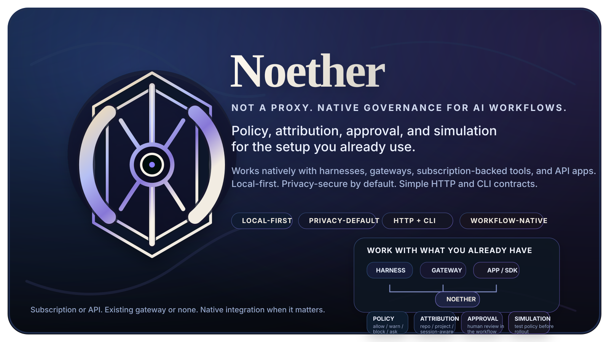
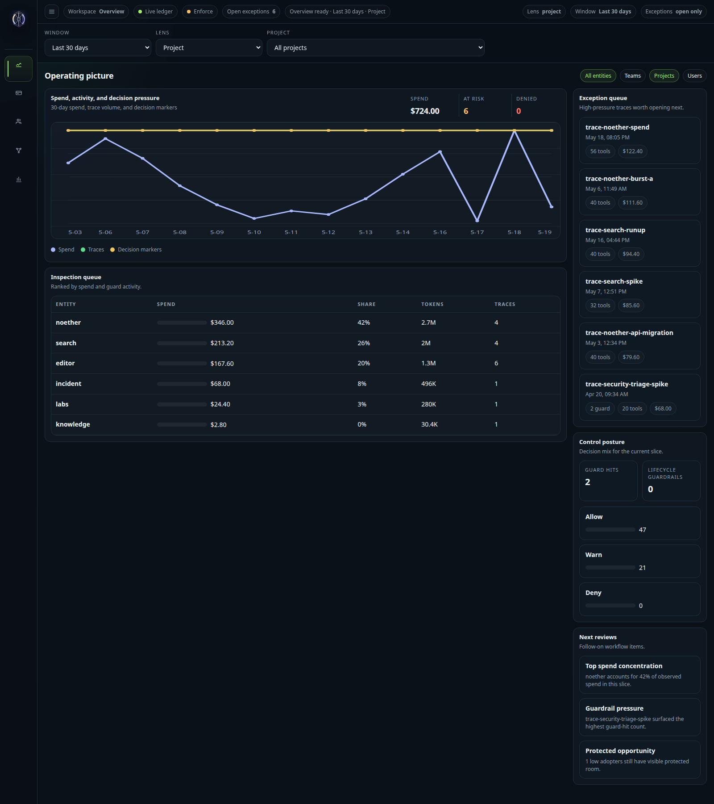
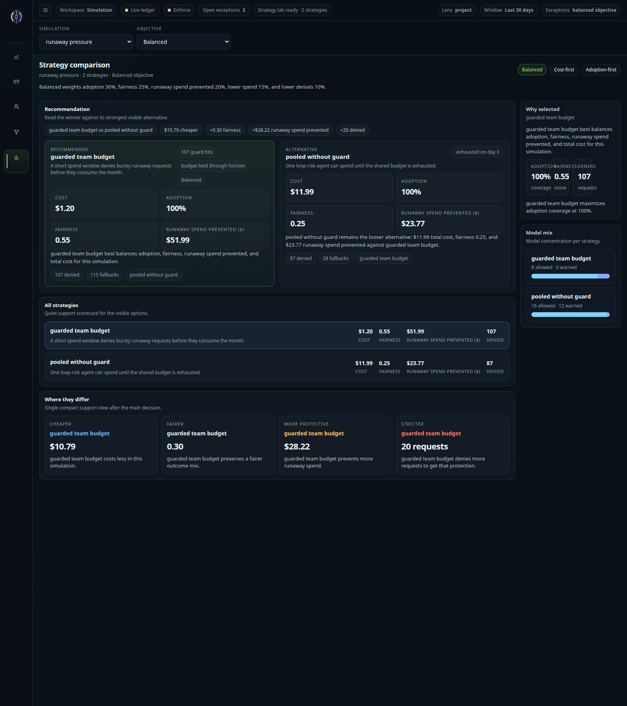
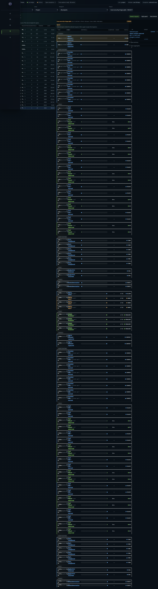
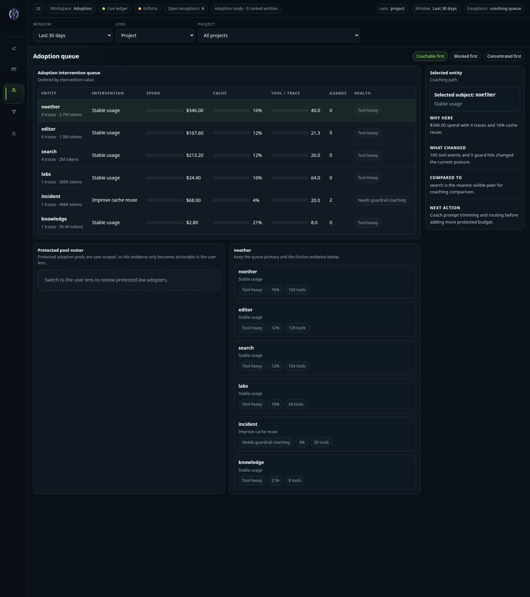

# Noether

**Not a proxy. Native governance for AI workflows.**

<p align="center">
  
</p>

Noether is the local-first governance layer for AI work.

It is for:

- individual operators who want local guardrails, visibility, and spend control
- teams that want attribution, approvals, and rollout safety
- orgs that want governance beside their existing harnesses and gateways

It works beside the workflow you already use:

- coding-agent harnesses
- subscription-backed tools
- API-driven apps and SDKs
- existing gateways and proxies

Noether helps answer the questions that show up as soon as AI usage becomes real:

- Should this request have been allowed before money was spent?
- Which repo, project, user, or task should pay for this run?
- Which tool burst, retry loop, or fallback path caused the cost?
- Are we only controlling spend, or also protecting healthy adoption?

Use your existing workflow. Keep your existing gateway if you have one. Use subscription-backed
tools, API-driven apps, or both.

## Why people use this

Most AI tooling is optimized for one of two jobs:

- make model access easier
- route model traffic more centrally

Those are useful, but they leave a governance gap:

- billing pages do not explain which run caused the spend
- harness logs do not decide whether the spend should have happened
- quotas do not distinguish productive adoption from runaway waste
- most people want progressive governance, not a forced platform rewrite

**Noether is the missing layer between AI usage and AI accountability.**

It is not trying to solve all of AI infrastructure.
It is trying to solve a smaller set of workflow-governance problems well:

- policy before spend
- attribution after the fact
- approval when needed
- simulation before rollout
- privacy by default throughout

## What the product actually does

- **Before spend:** allow, warn, block, ask, or fallback a request
- **After spend:** reconcile usage, traces, tools, and policy outcomes
- **For individuals:** keep local guardrails, visibility, and privacy without a platform rewrite
- **For teams:** attribute spend and policy outcomes to the right work
- **For rollout:** test policies in scenarios and simulations before enforcing them

## From one operator to one org

### For individuals

- keep using your existing AI tools
- add local guardrails and spend visibility
- see what your agent actually did
- keep prompts and workflow data local by default

### For teams

- add shared attribution and policy visibility
- introduce approval and governance progressively
- keep existing harnesses and gateways
- model policy changes before rollout

## See the product

<table>
  <tr>
    <td width="50%">
      <strong>Operating picture</strong><br>
      Live overview of spend, decision pressure, exceptions, and control posture.
    </td>
    <td width="50%">
      <strong>Strategy lab</strong><br>
      Compare policy strategies before rollout instead of guessing.
    </td>
  </tr>
  <tr>
    <td valign="top">
      
    </td>
    <td valign="top">
      
    </td>
  </tr>
  <tr>
    <td width="50%">
      <strong>Guardrail trace review</strong><br>
      Inspect policy outcomes, tool bursts, and request traces in one place.
    </td>
    <td width="50%">
      <strong>Adoption view</strong><br>
      See where usage is healthy, underused, or needs intervention.
    </td>
  </tr>
  <tr>
    <td valign="top">
      
    </td>
    <td valign="top">
      
    </td>
  </tr>
</table>

These are current product surfaces from the live dashboard, not placeholder mockups.

## Policy examples to copy

### 1. Require project attribution

Block AI work that cannot be charged to a real project:

```yaml
version: 0
budgets:
  - id: noether-dev-daily
    limit_usd: 1.00
    warn_at_fraction: 0.8
    window_seconds: 86400
    match:
      project: noether
policies:
  - id: require-project
    action: block
    reason: project is required for budget attribution
    when:
      missing: project
```

File: `examples/policy.noet.yaml`

### 2. Cap expensive single requests

Stop a runaway agent request before spend lands:

```yaml
limits:
  request_cost:
    max_usd: 1.0
    action: block
```

Based on: `examples/scenarios/runaway-agent-limit.noet.yaml`

### 3. Add burst and daily pacing

Use both a rolling burst cap and a daily cap:

```yaml
limits:
  spend:
    - window: 5h
      max_usd: 40
      action: block
    - window: 1d
      max_usd: 100
      action: block
```

Based on: `examples/scenarios/hybrid-budget-pacing-windows.noet.yaml`

### 4. Restrict models per budget

Allow only specific models on a budget:

```yaml
models:
  allow:
    - anthropic:claude-sonnet-*
```

Based on: `examples/scenarios/model-denial-fallback.noet.yaml`

### 5. Fallback to the right budget

Route requests to a more appropriate project budget:

```yaml
eligible:
  entities: [project:noether]
```

Based on: `examples/scenarios/project-budget-fallback.noet.yaml`

### 6. Protect adoption explicitly

Reserve room for lower adopters instead of letting heavy users take the whole budget:

```yaml
allocation:
  standard: protected_adoption_pool
  by: user
  protected_amount_usd: 25
```

Based on: `examples/scenarios/protected-adoption-pool.noet.yaml`

## One full policy example

Here is a more realistic policy that combines:

- a monthly project budget
- a warning threshold
- project-scoped eligibility
- a daily cap
- a short rolling burst cap

```yaml
version: 0
budgets:
  - id: personal-primary
    limit_usd: 1000
    warn_at_fraction: 0.8
    window_seconds: 2592000
    window_mode: tumbling
    window_anchor:
      kind: first_seen
    eligible:
      entities: [project:noether]
    limits:
      spend:
        - id: daily-cap
          window: 1d
          mode: tumbling
          anchor:
            kind: first_seen
          max_usd: 100
          action: block
        - id: burst-5h
          window: 5h
          mode: rolling
          max_usd: 40
          action: block
```

This is the kind of policy a real operator or team would actually run: a normal monthly budget with
extra protection against bursty agent behavior.

You can run the checked-in scenario for it here:

```bash
cargo run --bin noet -- scenario run examples/scenarios/hybrid-budget-pacing-windows.noet.yaml
```

That scenario shows:

- one request allowed normally
- one request blocked by a 5-hour burst window
- one request blocked by a daily cap

It writes a local ledger, reports, traces, and a dashboard under:

```text
.noet/scenarios/hybrid-budget-pacing-windows/
```

And if you want to compare whole policy strategies before rollout:

```bash
cargo run --bin noet -- simulate examples/simulations/runaway-pressure.noet.yaml
```

## HTTP or CLI, your choice

### HTTP

Ask Noether for a decision before spend:

```bash
curl -fsS http://127.0.0.1:4050/v1/authorize \
  -H 'content-type: application/json' \
  -d '{
    "subject": "user:demo",
    "project": "noether",
    "provider": "openai-codex",
    "model": "gpt-demo",
    "estimated_tokens": 1200,
    "estimated_cost_usd": 0.0024,
    "metadata": {
      "trace_id": "demo-trace-1",
      "request_id": "demo-request-1",
      "harness": "pi"
    }
  }'
```

### CLI

Run the end-to-end local proof:

```bash
./examples/vertical-mvp-demo.sh
```

Compare a policy strategy before rollout:

```bash
cargo run --bin noet -- simulate examples/simulations/runaway-pressure.noet.yaml
```

## Try it in 3 commands

```bash
./examples/vertical-mvp-demo.sh
cargo run --bin noet -- scenario run examples/scenarios/runaway-agent-limit.noet.yaml
cargo run --bin noet -- simulate examples/simulations/adoption-pressure.noet.yaml
```

Then open the generated dashboard artifact:

```bash
xdg-open .noet/noether-dashboard.html
```

## Works with the setup you already have

Noether is designed to be useful whether or not it owns the model call.

### Harness-first

Best fit when you want native workflow awareness:

- authorization before provider send
- repo / project / session-aware attribution
- tool, retry, and agent-step visibility
- approval inside the workflow when policy says `ask`

Current real integration:

- **Pi extension**

Planned near-term harness direction:

- Claude Code
- Codex
- OpenCode

### Gateway-sidecar

Best fit when you already have central routing and want governance beside it:

- keep your gateway
- add policy decisions, attribution, approval semantics, and analysis
- avoid turning Noether into another provider-compatibility product

## Use with Pi today

Start Noether:

```bash
cargo run --bin noet -- serve \
  --policy examples/policy.noet.yaml \
  --decision-mode enforce
```

Run Pi with the extension:

```bash
NOET_URL=http://127.0.0.1:4040 \
NOET_PI_PROJECT=noether \
NOET_PI_SUBJECT=user:local \
NOET_PI_BUDGET_ID=project-noether \
NOET_PI_ENTITIES=project:noether,user:local \
NOET_PI_FAIL_MODE=fail_open \
NOET_PI_POLICY_MODE=user_approved \
pi --extension "$PWD/extensions/pi-noether"
```

Inspect what happened:

```bash
cargo run --bin noet -- report decisions
cargo run --bin noet -- report usage
cargo run --bin noet -- report trace <trace_id>
cargo run --bin noet -- report observations --kind tool --trace <trace_id>
cargo run --bin noet -- report dashboard --out .noet/noether-dashboard.html
```

## Why this is different from a generic gateway

Noether is strongest where generic gateways are weakest:

- harness-aware attribution
- repo / project / task / session-aware budgeting
- approval inside agent workflows
- agent-native limits such as tools, retries, and steps
- local-first policy iteration
- scenario replay and strategy simulation before enforcement

That is the boundary:

- **gateway**: transport, routing, provider compatibility
- **Noether**: policy, attribution, approval, budgets, simulation

## What exists today

Noether is early, but real.

Today it includes:

- local `noet` sidecar
- `POST /v1/authorize`
- reservation finalization
- `POST /v1/events`
- SQLite-backed decision / usage / event ledger
- served live dashboard
- static export dashboards
- story-shaped CLI reports
- Pi extension integration
- bodyless authorization metadata by default
- checked-in scenarios and simulations

## Privacy defaults

Noether is local-first and privacy-secure by default:

- SQLite by default
- no cloud service required
- normal Pi authorization is bodyless by default
- prompt-like fields are summarized, not retained
- raw hook logging is explicit debug mode only

## Documentation

- [Product vision](./docs/product-vision.md)
- [Roadmap](./docs/roadmap.md)
- [Control contract v0](./docs/control-contract-v0.md)
- [Policy v0](./docs/policy-v0.md)
- [Pi extension integration](./docs/integrations/pi-extension.md)
- [Export and reporting API contract](./docs/export-reporting-api.md)
- [Team deployment](./docs/team-deployment.md)

## Non-goals

- Rebuild LiteLLM
- Become a proxy product
- Own provider protocol correctness as the product
- Store prompts by default
- Become a generic enterprise policy DSL

## License

License is not finalized yet.
