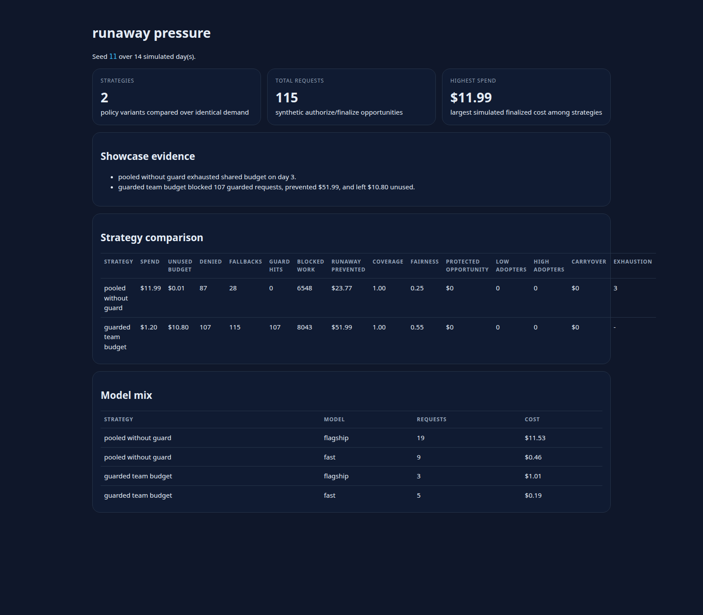
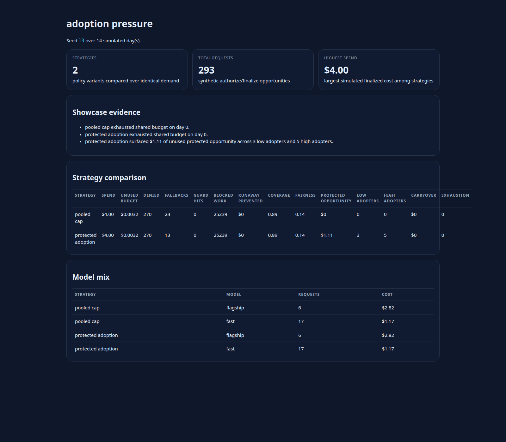
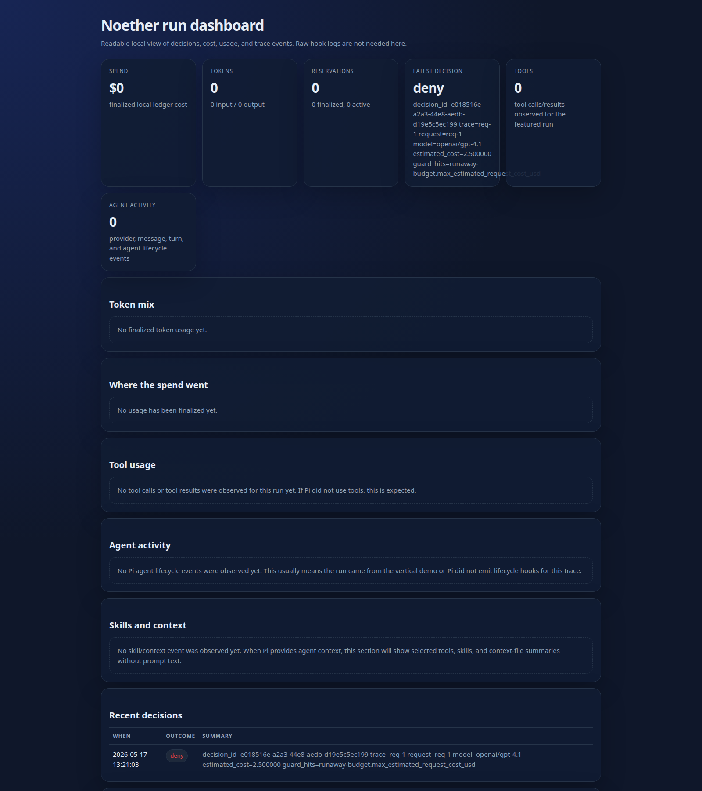

# Noether

**The local-first control plane for AI work.**

Noether helps a team answer the questions that show up right after AI usage becomes real:

- Which project or team should pay for this run?
- Was that model request allowed before money was spent?
- Which agent, tool burst, retry loop, or fallback caused the cost?
- Are we only controlling spend, or also helping people adopt AI well?

It sits beside the tools a team already uses, makes a decision before spend when possible, ingests
usage and lifecycle evidence afterward, and turns the result into an explainable ledger, reports,
and dashboards.

Noether is not another chat UI, prompt warehouse, or generic provider router. It is the missing
layer between AI usage and AI accountability.

## Why another AI tool?

Most AI tooling solves one of two problems:

- **Use models more easily**
- **Route model traffic more centrally**

Those are useful, but they still leave a practical gap for teams:

- provider billing does not explain which run, task, project, or user caused spend
- harness logs do not decide whether spend should have been allowed in the first place
- simple quotas do not distinguish productive adoption from runaway waste
- most teams want progressive governance: observe first, then warn, then enforce

Noether exists to make AI work legible before it becomes expensive, risky, or politically hard to
untangle later.

```text
AI agent / app / gateway
        |              \
        | authorize     \ events + usage
        v                v
   allow / warn / deny   trace ingest
          \             /
           \           /
      budget + policy + ledger + dashboard
```

## What value it gives a team

Noether is built for the point where AI use moves from personal experimentation to shared,
budgeted, semi-governed work.

- **Before spend:** allow, warn, deny, or fallback a request using local policy and budget rules
- **After spend:** reconcile what actually happened into a durable local ledger
- **For humans:** explain usage in plain artifacts a team can inspect later
- **For policy design:** run checked-in scenarios and simulations to prove claims before rollout

That means Noether can help a team:

- cap runaway usage without blocking everything
- attribute spend to the right project, team, or user
- preserve room for adoption instead of letting heavy users consume all budget
- show evidence for a policy decision instead of relying on intuition

## See the value locally in a few minutes

### 1. Run a safe local demo

```bash
./examples/vertical-mvp-demo.sh
```

Then generate a visual dashboard:

```bash
cargo run --bin noet -- report \
  --db-path .noet/demo/vertical-mvp.sqlite \
  dashboard \
  --out .noet/noether-dashboard.html
```

Open the generated file in a browser:

```bash
xdg-open .noet/noether-dashboard.html
```

### 2. Replay a scenario that proves a policy behavior

```bash
cargo run --bin noet -- scenario run examples/scenarios/runaway-agent-guard.noet.yaml
```

This generates a local ledger, JSON reports, traces, and an HTML dashboard under:

```text
.noet/scenarios/runaway-agent-guard/
```

### 3. Compare strategies before adopting one

```bash
cargo run --bin noet -- simulate examples/simulations/adoption-pressure.noet.yaml
```

This writes a top-level simulation dashboard plus per-strategy dashboards under:

```text
.noet/simulations/adoption-pressure/
```

The checked-in simulations are meant to show value quickly:

- `synthetic-company.noet.yaml`: pooled caps vs protected adoption for a mixed team
- `runaway-pressure.noet.yaml`: a spend-window guard preserving budget under loop-risk load
- `adoption-pressure.noet.yaml`: protected adoption surfacing underused opportunity for low adopters

## What the checked-in proof points already show

These are not marketing mockups. They come from deterministic examples in this repo.

- In `runaway-pressure.noet.yaml`, the unguarded shared budget exhausts on simulated day 3, while
  the guarded strategy blocks 107 risky requests, prevents about `$51.99` of runaway spend, and
  still leaves about `$10.80` unused instead of letting one loop consume the month.
- In `adoption-pressure.noet.yaml`, protected adoption surfaces about `$1.11` of unused protected
  opportunity across 3 low adopters and 5 high adopters, which is exactly the kind of signal
  ordinary billing pages do not provide.
- In `synthetic-company.noet.yaml`, both strategies spend the same total amount, but the protected
  adoption strategy still exposes preserved opportunity that pooled caps hide.

## What it looks like

<p>
  
  
</p>

<p>
  
</p>

- **Runaway control:** the simulation dashboard shows the difference between a shared cap and a
  guarded budget before a team adopts a policy.
- **Adoption visibility:** the simulation dashboard exposes low-adopter and high-adopter behavior,
  not only spend totals.
- **Explainable decisions:** the run dashboard shows the exact deny outcome and guard hit that
  stopped a risky request before spend.

## What Noether does

## Product pillars

### Observe

Make AI work visible before controlling it.

- request decisions
- provider/model usage
- cost and token accounting
- trace timelines
- tool and agent activity
- eval/annotation events
- local SQLite ledger
- static HTML dashboard

### Attribute

Make usage belong somewhere.

- user/project/team/org/purpose entities
- explicit or inferred budget routing
- project derivation helpers over time
- missing-attribution warnings
- selected-budget explanations

### Control

Apply lightweight, explainable governance.

- allow / warn / deny
- model allowlists
- budget selection and reservation
- spend windows such as 5h / 7d
- request-cost and context-size limits
- future tool-call, retry, and agent-step guards
- fail-open or fail-closed deployment modes

### Improve

Help teams use AI better, not just cheaper.

- low-adoption visibility
- protected adoption pools
- bounded carryover
- underused budget as opportunity signal
- context-heavy or tool-heavy run detection
- model-denial and fallback reporting

### Simulate

Prove product claims with executable scenarios.

- native end-to-end examples for common use cases
- synthetic company simulations with user profiles and strategy comparisons
- report/dashboard assertions for CI
- reproducible examples that require no live provider credentials

## What works today

Noether is early but functional.

Today it includes:

- local `noet` sidecar;
- `POST /v1/authorize`;
- reservation finalization;
- `POST /v1/events`;
- SQLite-backed decision/usage/event ledger;
- story-shaped CLI reports;
- static HTML dashboard;
- Pi extension integration;
- bodyless authorization metadata by default;
- opt-in raw hook debug logs;
- vertical MVP demo with no provider credentials.

The policy model is still v0. The next product phase is the entity-based AI budget model described
in [`docs/design/ai-budget-allocation-standards.md`](./docs/design/ai-budget-allocation-standards.md).

## Scenario examples

Replay checked-in local scenarios with no provider credentials:

```bash
cargo run --bin noet -- scenario run examples/scenarios/local-developer.noet.yaml
cargo run --bin noet -- scenario run examples/scenarios/team-pooled-budget.noet.yaml
```

Each run writes a fresh SQLite ledger, JSON reports, per-request traces, and an HTML dashboard
under `.noet/scenarios/<scenario-name>/`.

Additional checked-in scenarios cover:

- project budget fallback
- model-denial fallback
- runaway-cost guard denial
- protected adoption pool behavior

## Simulation examples

Compare checked-in strategies against deterministic synthetic demand:

```bash
cargo run --bin noet -- simulate examples/simulations/synthetic-company.noet.yaml
cargo run --bin noet -- simulate examples/simulations/runaway-pressure.noet.yaml
cargo run --bin noet -- simulate examples/simulations/adoption-pressure.noet.yaml
```

Each simulation writes a comparison report, a top-level simulation dashboard, and per-strategy
dashboards under `.noet/simulations/<simulation-name>/`.

- `synthetic-company.noet.yaml` compares pooled caps against protected adoption for a mixed team.
- `runaway-pressure.noet.yaml` shows how a spend-window guard preserves budget under loop-risk load.
- `adoption-pressure.noet.yaml` shows protected adoption surfacing unused opportunity for low adopters.

## Use with Pi

Start Noether:

```bash
cargo run --bin noet -- serve \
  --policy examples/policy.noet.yaml \
  --decision-mode enforce
```

Run Pi with the extension:

```bash
NOET_URL=http://127.0.0.1:4040 \
NOET_PI_PROJECT=noether \
NOET_PI_SUBJECT=user:local \
NOET_PI_BUDGET_ID=project-noether \
NOET_PI_ENTITIES=project:noether,user:local \
NOET_PI_FAIL_MODE=fail_open \
pi --extension "$PWD/extensions/pi-noether"
```

Inspect results:

```bash
cargo run --bin noet -- report decisions
cargo run --bin noet -- report usage
cargo run --bin noet -- report trace <trace_id>
cargo run --bin noet -- report observations --kind tool --trace <trace_id>
cargo run --bin noet -- report dashboard --out .noet/noether-dashboard.html
```

## Privacy posture

Noether is local-first.

- SQLite by default.
- No cloud service required.
- Normal Pi extension authorization is bodyless by default.
- Prompt-like fields are summarized, not retained.
- Raw hook logging is explicit debug mode only.
- Capture/proxy modes are for controlled local inspection and redact credential-like fields.

## Scenario emulator vision

Noether should ship with two kinds of executable examples:

1. **Native end-to-end scenarios**
   - individual local developer
   - team pooled budget
   - project budget fallback
   - model-denial/fallback
   - runaway agent guard
   - protected adoption pool

2. **Strategy simulations**
   - synthetic company of hundreds or thousands of users
   - different usage profiles such as power users, steady users, low adopters, and loop-risk agents
   - strategy comparison across pooled caps, protected adoption pools, reserved/shared budgets, and
     other future standards

The point is not only testing. It is evidence: every major public claim Noether makes should have a
scenario that demonstrates it.

## Documentation

- [Product vision](./docs/product-vision.md)
- [Roadmap](./docs/roadmap.md)
- [Team deployment](./docs/team-deployment.md)
- [Export and reporting API contract](./docs/export-reporting-api.md)
- [AI budget allocation standards](./docs/design/ai-budget-allocation-standards.md)
- [Control contract v0](./docs/control-contract-v0.md)
- [Policy v0](./docs/policy-v0.md)
- [Pi extension integration](./docs/integrations/pi-extension.md)
- [Capture fixture schema v1](./docs/capture-fixtures.md)
- [Transparent proxy mode](./docs/transparent-proxy.md)

## Non-goals

- Rebuild LiteLLM.
- Own provider protocol correctness as the product.
- Store prompts by default.
- Become a generic enterprise policy DSL.
- Productize consumer-subscription tunneling.
- Encode one company's quota policy as the product model.

## License

License is not finalized yet.
