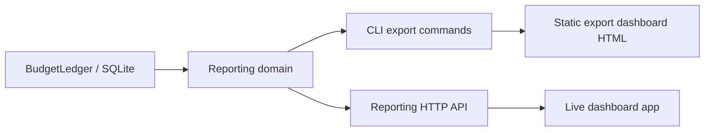

# Product surface gap closure plan — 2026-05-17

## Goal

Close the audited gap between:

- the real product people expect from the words “dashboard” and “reporting API”, and
- the narrower static artifact flow currently implemented in the CLI.

This plan intentionally avoids a hacky “make the snapshot live” approach.

## Chosen direction

Build a real reporting surface with three explicit product layers:

1. **Static export dashboard**
   - CLI-generated artifact for scenarios, simulations, sharing, and offline review
2. **Reporting HTTP API**
   - server-served JSON and export HTML backed by the same ledger/read model
3. **Live dashboard app**
   - browser UI served by `noet serve`, backed by the reporting API, with live refresh behavior

The static export dashboard remains a product feature, but it stops pretending to be the live UI.

## Product language to adopt

Use these names consistently:

- **Static export dashboard** — generated HTML artifact
- **Reporting API** — HTTP read endpoints over report data
- **Live dashboard** — browser UI served by Noether

Avoid using the bare word `dashboard` in docs and roadmap items unless the specific surface is
clear from context.

## Architecture target

## Design constraints

- Do not make the live UI depend on `src/cli.rs` HTML-string rendering.
- Keep `render_dashboard(...)` as the export artifact path unless/until it is replaced by a shared
  export renderer.
- Reuse the existing ledger read seams from `src/ledger.rs`.
- Keep local-first deployment intact:
  - SQLite stays the default
  - `noet serve` remains one-process local-first
- Do not invent a server-side simulation registry in this slice.
- Close wording gaps immediately when a capability remains future-facing.

## Planned workstreams

### Workstream 1 — correct product language immediately

Purpose:

Stop overclaiming before shipping new code.

Scope:

- Update roadmap/backlog wording so “dashboard” is qualified.
- Change “Export/reporting API exists” to either:
  - a concrete live task in progress, or
  - a future acceptance item not yet completed.
- Fix team deployment wording so it says:
  - same control contract today
  - reporting over HTTP arrives only after the reporting API lands

Verification:

- audit findings no longer reproduce in doc wording

### Workstream 2 — extract a shared reporting domain

Purpose:

Create a real read layer that both CLI export and server routes can use.

Likely module shape:

- `src/reporting.rs` or `src/reporting/mod.rs`

Responsibilities:

- compose report reads from `BudgetLedger`
- define server-safe view models for:
  - usage
  - decisions
  - traces
  - observations
  - dashboard page data / sections
- centralize trace selection and report assembly logic now embedded in `run_report`

Non-goals:

- do not move presentation-specific CSS/HTML generation into the reporting domain

Verification:

- existing CLI dashboard/report tests stay green
- focused unit tests for reporting composition

### Workstream 3 — implement the reporting HTTP API

Purpose:

Turn proposed report shapes into real server capabilities.

Initial endpoints:

- `GET /v1/reports/usage`
- `GET /v1/reports/decisions`
- `GET /v1/reports/traces/{trace_id}`
- `GET /v1/reports/observations?kind=<prefix>&trace=<trace_id>`
- `GET /v1/reports/dashboard?trace=<trace_id>`

Notes:

- `GET /v1/reports/dashboard` should return export HTML as an artifact endpoint, matching the
  existing contract proposal.
- JSON field names should match the current CLI JSON contract.

Verification:

- new server tests in `src/server.rs`
- parity checks against CLI JSON outputs
- export HTML route renders the same core story as the CLI export path

### Workstream 4 — implement a real live dashboard app

Purpose:

Provide a served UI that is actually part of the product, not just a generated file.

Initial UX scope:

- route such as `GET /dashboard`
- deep link for a selected trace when available
- summary-first layout for:
  - outcome summary
  - policy decisions
  - spend and adoption
  - run evidence
- trace selection / switching when multiple traces exist
- explicit empty states

Recommended delivery shape:

- server-served HTML shell
- server-served static JS/CSS assets
- data fetched from the reporting HTTP API

Rationale:

- avoids coupling the live UI to CLI HTML rendering
- keeps the reporting API as the source of truth
- avoids introducing a build-heavy frontend stack before product boundaries are stable

Verification:

- server route tests
- browser-level smoke validation using generated screenshots
- focused UI assertions on rendered HTML markers and states

### Workstream 5 — add live refresh in a first-class way

Purpose:

Make the live dashboard actually live.

Preferred approach for the current single-process SQLite deployment:

- SSE invalidation/update stream from `noet serve`
- browser UI re-fetches relevant report JSON after update notifications

Why this is acceptable now:

- current shared deployment guidance is one process with SQLite
- in-process update broadcast matches that deployment model

Follow-up caveat:

- if multi-writer/shared-storage arrives later, update propagation must move beyond in-process
  broadcast

Verification:

- server test for stream/invalidation behavior
- browser smoke showing the dashboard updates after authorize/finalize/event ingest

### Workstream 6 — explicitly defer simulation HTTP surfaces unless a persistence model is added

Purpose:

Avoid faking a simulation API without a real storage/query model.

Action:

- keep simulation HTTP endpoints as future work unless simulation runs become server-owned records
- move simulation HTTP API wording out of “exists now” surfaces

Verification:

- no docs claim a shipped simulation API before the backing model exists

## Delivery sequence

1. **Docs correction**
2. **Shared reporting domain extraction**
3. **Reporting HTTP API**
4. **Live dashboard shell and routed UI**
5. **Live refresh**
6. **Simulation API wording cleanup or separate future design**
7. **Human visual acceptance review**

## Vertical task breakdown

### Task 1 — terminology and contract correction

Outcome:

Docs stop overstating current dashboard/API capability.

Acceptance:

- audited doc mismatches are corrected
- dashboard terminology is qualified
- reporting API status is explicit

Verification:

- diff review against `docs/roadmap.md`, `docs/github-issues.md`, `docs/team-deployment.md`

### Task 2 — shared reporting domain

Outcome:

Server and CLI can both consume the same report assembly layer.

Acceptance:

- reporting module exists
- `run_report` no longer owns all report assembly logic ad hoc
- no behavior drift in current report JSON / export flows

Verification:

- existing CLI report/dashboard tests
- new unit tests for reporting assembly

### Task 3 — reporting HTTP API

Outcome:

`noet serve` exposes real report endpoints.

Acceptance:

- `/v1/reports/*` endpoints implemented
- route tests cover success and filtering behavior
- HTML export endpoint works

Verification:

- new `src/server.rs` tests
- manual curl/browser smoke

### Task 4 — live run dashboard

Outcome:

Users can open a served dashboard in the browser from `noet serve`.

Acceptance:

- dashboard route exists
- summary, policy, spend/adoption, and evidence sections render from live data
- multiple traces and empty states are handled coherently

Verification:

- browser smoke
- screenshot review

### Task 5 — live refresh transport

Outcome:

The served dashboard updates as Noether ingests new decisions, finalizations, and events.

Acceptance:

- server emits update notifications
- UI refreshes without reload
- no polling-only hack tied to export HTML

Verification:

- automated smoke with ingest + update
- manual visual confirmation

### Task 6 — final visual and parity review

Outcome:

The live dashboard is accepted as a real product surface, and the static export dashboard remains
useful for offline review.

Acceptance:

- visual review of live UI
- visual review of export UI
- naming and docs aligned with shipped capability

Verification:

- screenshots
- checklist against audited gaps

## Out of scope for this closure plan

- Postgres migration
- multi-tenant auth
- Majin cockpit integration
- simulation run registry / persisted simulation browsing
- replacing the static export dashboard with the live UI

## Closure criteria

These gaps are closed only when all are true:

1. `noet serve` exposes real report endpoints.
2. `noet serve` serves a real dashboard UI.
3. the live UI is backed by reporting data, not by CLI snapshot HTML reuse.
4. docs no longer describe proposed-only capabilities as existing.
5. static export and live UI are described as different product surfaces.

